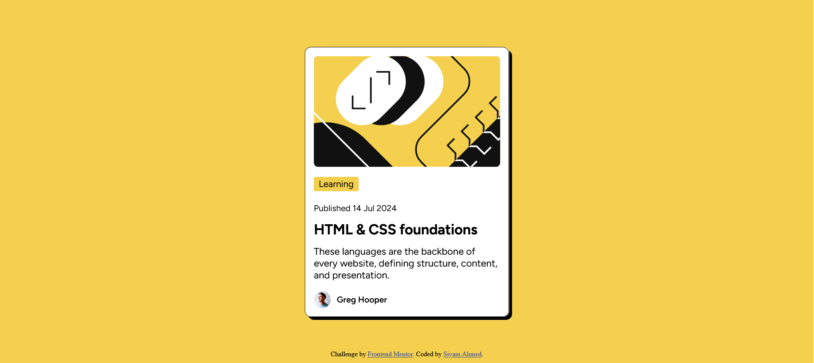

# Frontend Mentor - Blog preview card solution

This is a solution to the [Blog preview card challenge on Frontend Mentor](https://www.frontendmentor.io/challenges/blog-preview-card-ckPaj01IcS). Frontend Mentor challenges help you improve your coding skills by building realistic projects. 

## Table of contents

- [Overview](#overview)
  - [The challenge](#the-challenge)
  - [Screenshot](#screenshot)
  - [Links](#links)
- [My process](#my-process)
  - [Built with](#built-with)
  - [What I learned](#what-i-learned)
  - [Continued development](#continued-development)
  - [Useful resources](#useful-resources)
- [Author](#author)
- [Acknowledgments](#acknowledgments)

## Overview

### The challenge

Users should be able to:

- See hover and focus states for all interactive elements on the page

### Screenshot

### Links

- Solution URL: [Add solution URL here](https://your-solution-url.com)
- Live Site URL: [Add live site URL here](https://your-live-site-url.com)

## My process

### Built with

- Semantic HTML5 markup
- CSS custom properties
- Flexbox

### What I learned

- Brushed up the knowledge of HTML box model
- Learned to give padding to the container once and use the padding for all the children
- Flexbox gap property
- Positioning at the center using absolute positioning and translate function

### Continued development

### Useful resources

## Author

- Website - [Siyam Ahmed](https://siyam-ahmed.netlify.app)
- Frontend Mentor - [@Siyam1888](https://www.frontendmentor.io/profile/Siyam1888)
- Twitter - [@siyam_88](https://www.twitter.com/siyam_88)

## Acknowledgments
